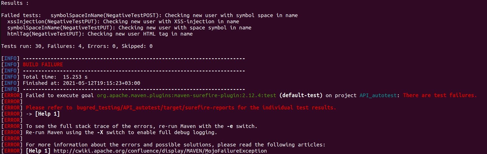

# Bugred API testing 
## Project description
The project consists of two modules:
 * API_autotest - testing API part;
 * simple_UI_test - testing UI part.

## Build and run

### Prepare environment
```
//make git clone
git clone https://github.com/MakarovaIV/bugred_testing.git
```
NOTE: Project runs with **Maven** 3.8.1+.

If you don't have maven,
use the official website for [downloading](https://maven.apache.org/download.cgi)
and [installation](https://maven.apache.org/install.html).

### API_autotest
Open a terminal from where the project will be placed.

```
//change directory to module API_autotest
cd bugred_testing/API_autotest

//run tests
mvn test
```

### simple_UI_test

```
cd bugred_testing/simple_UI_test
mvn test
```

## Errors
Module API_autotest has 4 failed tests.
You will see similar information in terminal.



Bugs are described in the bug report.

## Artifacts
Artifacts were made after manual testing website [bugred](http://users.bugred.ru)
in Postman.

Checklist, test-cases and bug report [here](https://docs.google.com/spreadsheets/d/1rUdgbhy0x3Z7cwj6roaaOKP2CQn0fGcf2NMzpR5g8Hg/edit?usp=sharing).

